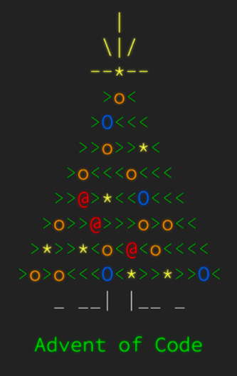

# Coding problems
I like doing coding problems and the best way to learn is to teach so here are some solutions. I hope someone finds it useful.

##  HackerRank
https://www.hackerrank.com/lightwastaken

1. [Hackerrank - SQL Easy](Hackerrank/SQL_Easy.md)
2. [Hackerrank - SQL Medium](Hackerrank/SQL_Medium.md)
 
##  LeetCode
https://leetcode.com/lightwastaken/
I started with Leetcode 75 but decided to keep it a bit more organized, so there are individual lists for easy, medium, hard.

1. [LeetCode 75](Leetcode/Leetcode_75.md)
2. [Leetcode easy](Leetcode/Leetcode_easy.md)
3. [Leetcode medium](Leetcode/Leetcode_medium.md)
4. [Leetcode hard](Leetcode/Leetcode_hard.md)

##  Advent of Code
https://adventofcode.com/

1. [Advent of Code 2022](AoC/Advent_of_Code_2022.md)
